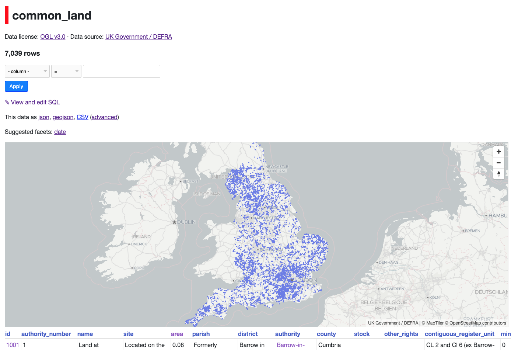

# Datasette Geo

**Work in progress. Don't expect this to work yet, especially since it depends on a lot of unmerged Datasette features.**

A plugin to make Spatialite databases effortlessly explorable with [Datasette](https://github.com/simonw/datasette).



## Features

* Better representation of Spatialite geometries in table views
* Fast, scalable map viewing using Mapbox GL and an integrated Mapbox Vector Tile server
* GeoJSON export endpoints
* Maybe more?

## Database Preparation
The database you're using needs to have the geographic data stored in Spatialite geometry columns. These columns must be indexed, which you can do with the following SQL:
```sql
	SELECT CreateSpatialIndex('table_name', 'column_name');
```

## Configuration

You'll need to make sure the Spatialite module is loaded by Datasette, [as described in the docs](https://datasette.readthedocs.io/en/stable/spatialite.html).

After this, Datasette Geo should work out of the box, automatically detecting the Spatialite column in your tables
and rendering them. You may want to increase your `sql_time_limit_ms` configuration setting to allow enough time for
large vector tiles to be rendered.

## Base Maps
By default, Datasette Geo uses the standard [OpenStreetMap](https://openstreetmap.org) raster tiles as a base map, as they require no authentication to access. Please note if you deploy Datasette Geo with these tiles, you must comply with the OSM
[Tile Usage Policy](https://operations.osmfoundation.org/policies/tiles/).

Raster tiles are not as fast and pretty as using a vector tile source, so you can configure Datasette Geo to use
a vector tile source instead. Note that (to my knowledge) all available vector tile services are paid services although
Mapbox and MapTiler have free tiers:

### Mapbox
You'll need a Mapbox account so you can fetch an [access token](https://account.mapbox.com/access-tokens/). 
You'll also need a style URL, which can either be one of Mapbox's [default styles](https://docs.mapbox.com/api/maps/#mapbox-styles)
or a custom style generated with [Mapbox Studio](https://studio.mapbox.com/).

Configure it in your `metadata.json`:
```json
    "plugins": {
	    "datasette-geo": {
		"mapbox_token": "<Mapbox access token>",
		"style": "mapbox://styles/mapbox/light-v10"
	    }
    }
```
### MapTiler
[MapTiler](https://maptiler.com) is another source of vector tile data which is cheaper than Mapbox. [Choose your map](https://cloud.maptiler.com/maps/) and you'll be given a vector style URL:
```json
    "plugins": {
	    "datasette-geo": {
		"style": "https://api.maptiler.com/maps/positron/style.json?key=<MapTiler key>"
	    }
    }
```

### Custom Style File
You can generate a custom [Mapbox GL style file](https://docs.mapbox.com/mapbox-gl-js/style-spec/) using a tool like
[Maputnik](https://maputnik.github.io/), or by hand-writing it if you're especially keen. Note that you will
still need to define a tile source in the style file. Add it to your Datasette project static directory, and reference it in `metadata.json`
like so:
```json
    "plugins": {
	    "datasette-geo": {
		"style": "/static/mystyle.json"
	    }
    }
```
